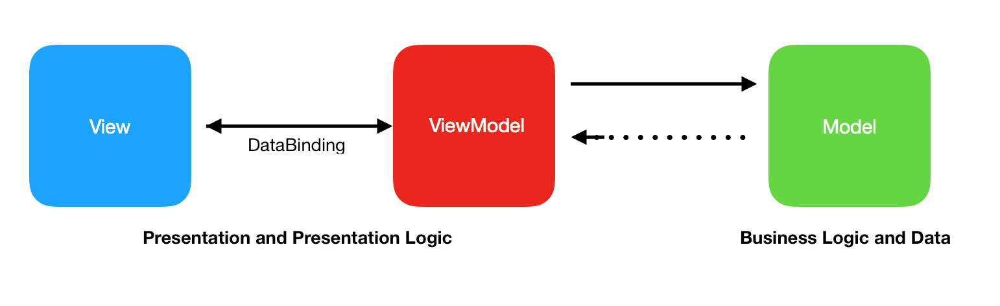

# Notes App with Node JS

## User Stories:

I have used the User Stories from a previous Makers project (
 )

```
As a programmer
I can see a list of my notes, where each note is abbreviated to the first 20 characters
So I can find the one I want
```

```
As a programmer
I can create a new note
So I can record something I need to remember
```

```
As a programmer
I can see the full text of an individual note on its own page
So I can see all the information in the note
```

## Methods required in Notes Class
- .listOfNotes

-  .abbreviatedList

- .createNote

- .fullNote

## MVVC

### Model:

Notes Class,

Node Server connection and to Mongo DB

### View Model:

React

### View:

HTML
